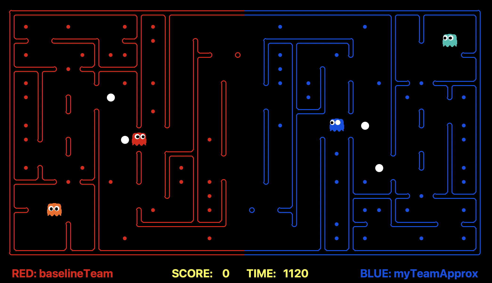

# Mini-Contest 2: Multi-Agent Adversarial Pacman

This repository contains the code for the Mini-Contest 2: Multi-Agent Adversarial Pacman, a project for CS 275: Artificial Life for Computer Graphics and Vision. The project involves developing multi-agent systems using Q-learning and evolutionary algorithms to create competitive Pacman agents.

## Project Overview

The goal of this project is to implement a dynamic and competitive multi-agent environment where agents utilize Q-learning and evolutionary strategies to optimize their gameplay. The agents will demonstrate advanced strategic thinking, adaptability, and competitive behaviors.

## Game View

Below is a visual representation of the game layout used in our Capture The Flag Pacman project:



## Getting Started
1. Clone the repository and cd into the src directory. 
2. To run the Python simulation with the various algorithms, use the following command:
    ```bash
    python capture.py <team1> <team2>
    ```
    You can find the team names from the team file names. For example, to pit greedy agents against approximate Q-learning agents for 100 games on random layout boards, use the following command:
    ```bash
    python capture.py -r baselineTeam.py -b myTeamApproxQLearningAgent.py -n 100 -l RANDOM
    ```
3. You can open the `CFT-Pacman` folder in Unity to experience the game alternatively, but the final simulation with all available algorithms is simply in Python.

## Project Structure

- **src/**: Contains the main source code for running the simulations.
- **CFT-Pacman/**: Unity project folder for visualizing the game environment.
- **docs/**: Documentation of the project.

## Evaluation and Results

To test the efficacy of our developed agents, we conducted a series of games comparing our learning-based agents against baseline greedy agents. Our Approximate Q-Learning agents demonstrated superior performance with an 84% win rate, showcasing their ability to adapt and strategize effectively.

## Future Work

### Enhance Team-Based Strategies
Our current implementation focuses primarily on individual agent behaviors. Future research will extend this to incorporate more sophisticated team-based strategies, leveraging multi-agent reinforcement learning techniques to enable agents to communicate and coordinate their actions more effectively. This approach aims to find unique ways to defeat opponents and optimize overall team performance.

### Integrate Advanced Learning Techniques
Future work will explore integrating advanced learning techniques such as deep Q-networks (DQN) and Double DQN to further enhance the learning capabilities of our agents. These techniques have shown significant improvements in learning efficiency and performance in various environments, potentially leading to even more intelligent and adaptive behaviors in our Pacman agents. Additionally, methods like hierarchical reinforcement learning and actor-critic algorithms will be investigated to improve decision-making processes.

### Explore Curriculum Learning
To improve the generalization capabilities of our agents, we will investigate the use of curriculum learning. This involves training agents on simpler tasks before gradually increasing the complexity, leading to more robust learning outcomes. Curriculum learning can help agents develop foundational skills and gradually build on them to handle more complex scenarios effectively.

## Contributors

- Kevin Lee
- Yu-Hsin Weng
- Varun Kumar
- Siddarth Chalasani

## Acknowledgments

We would like to thank Professor Terzopoulos for his guidance and support throughout this project.

## References

For more detailed information on the advanced techniques and methodologies we aim to integrate into our future work, please refer to the following sources:

- Schulman, John, et al. "Proximal policy optimization algorithms." arXiv preprint arXiv:1707.06347 (2017).
- Kingma, Diederik P., and Jimmy Ba. "Adam: A method for stochastic optimization." arXiv preprint arXiv:1412.6980 (2014).
- Lowe, Ryan, et al. "Multi-agent actor-critic for mixed cooperative-competitive environments." arXiv preprint arXiv:1706.02275 (2017).
- Foerster, Jakob, et al. "Counterfactual multi-agent policy gradients." Proceedings of the AAAI Conference on Artificial Intelligence. 2018.
- Pan, Sinno Jialin, and Qiang Yang. "A survey on transfer learning." IEEE Transactions on knowledge and data engineering 22.10 (2009): 1345-1359.
- Bengio, Yoshua, et al. "Curriculum learning." Proceedings of the 26th annual international conference on machine learning. 2009.

These references provide foundational knowledge and advanced insights into the techniques we plan to implement and explore in future iterations of our project.
